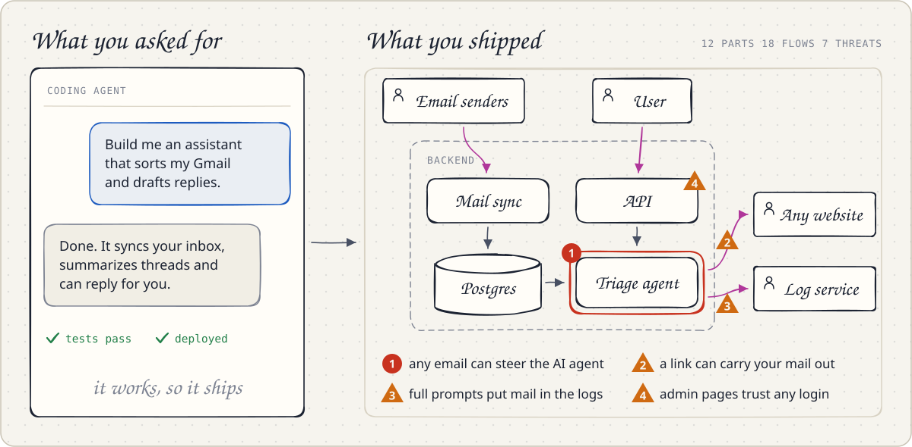
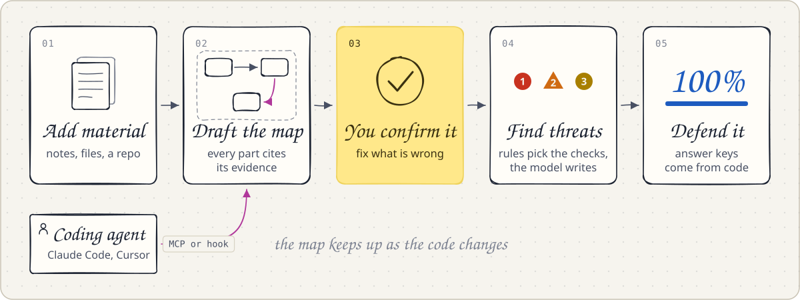
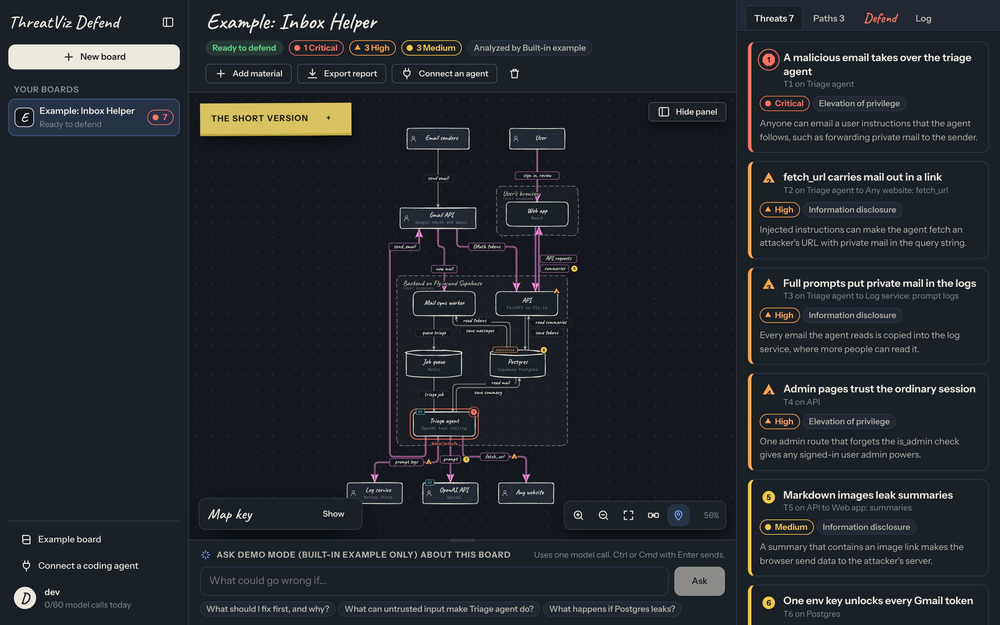
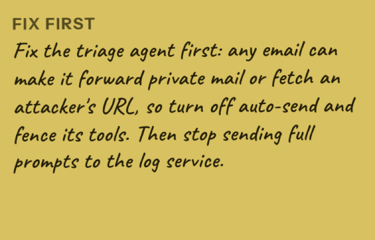
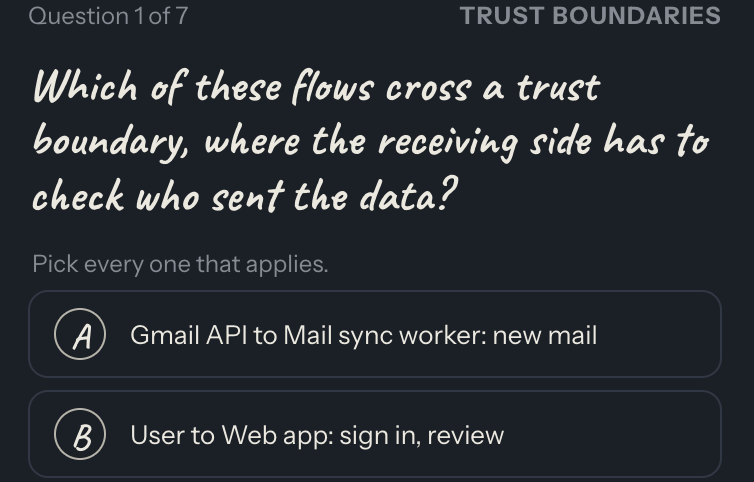
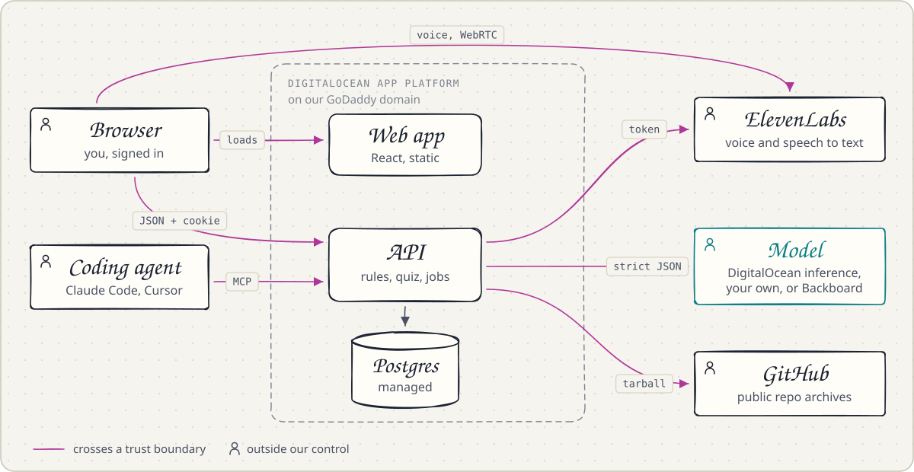
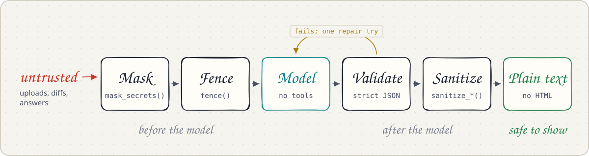

# ThreatViz Defend

Coding agents let anyone ship an app they cannot explain. ThreatViz Defend reads your code and docs, draws the system as a threat model, and quizzes you until you can defend it at a whiteboard.

<!-- TODO: point Live app and Demo video at the real URLs before submitting -->
**[Live app](#)** · **[Demo video](#)** · Built at [hackUMBC 2026](#hackumbc-2026)

## The problem

Vibe coding is building software by telling a coding agent what you want and shipping what it writes. The code comes fast, but the understanding never forms. Nobody on the team holds a mental model of what shipped, so nobody can say which parts exist, where the data goes, or what trusts what.

Security depends on that model. Threat modeling, code review and incident response all assume someone understands the design. With vibe coding, often no one does, and the flaws stay hidden until an attacker finds them.

<picture>
  <source media="(prefers-color-scheme: dark)" srcset="docs/images/problem-dark.svg">
  
</picture>

## Our solution

ThreatViz Defend builds that mental model with you, from your own code, and then checks that it stuck. Reading a threat report is not the same as understanding it, so every board ends with a quiz on your own design.

It does not tell you a system is secure. It shows you where to look, and checks that you understood.

<picture>
  <source media="(prefers-color-scheme: dark)" srcset="docs/images/how-it-works-dark.svg">
  
</picture>



<sub>The Inbox Helper from the problem above, mapped by ThreatViz Defend. Each numbered pin is a threat.</sub>

| Know what to fix first | Prove you understand it |
|:---:|:---:|
|  |  |

## Why it is a cybersecurity tool

- **Threat modeling for every developer.** Security teams use threat models to find design flaws before attackers do. ThreatViz Defend runs the same method on any codebase in minutes: STRIDE checks on every part, every flow that crosses a trust boundary, and the lethal trifecta on AI agents, which is private data, untrusted input and a way to send data out.
- **It trains the defender.** A report nobody understands fixes nothing. The quiz makes sure the person who ships the code can explain how it can be attacked and what stops it.
- **It keeps up with AI-written code.** Agents change a system faster than anyone can review it. Connected over MCP or a hook, every change redraws the map and waits for a person to confirm it.
- **It is defensive only.** It reads the material you give it. It never scans, probes or attacks a running system.

## Try it

**Hosted.** During hackUMBC, open the [live app](#) and create an account with the invite code from the organizers.

**On your machine.** You need Python 3.12 with [uv](https://docs.astral.sh/uv/) and Node 24.

```sh
./scripts/dev.sh
```

Open http://localhost:5173 and sign in with `DEV_USERNAME` and `DEV_PASSWORD` from `.env`. Without a model key, the app runs in demo mode on the Inbox Helper example.

<details>
<summary>Run each half on its own</summary>

```sh
cp .env.example .env          # once; the API reads the repo-root .env on its own
cd api && uv sync
uv run uvicorn app.main:app_from_env --factory --port 8000
```

```sh
cd web && npm install && npm run dev
```

The server creates the development account at startup, with the example board, and resets it to that password if you change it. To try sign up instead, choose **Create an account** with the invite code `local-dev`. Development uses a SQLite database in `api/data/app.db`.

</details>

<details>
<summary>Demo mode and real models</summary>

In demo mode every new account gets the example board ("Example: Inbox Helper") to explore, ask recorded questions about, and quiz yourself on. It cannot map your own material, and it grades open answers by keyword.

To use a real model, pick one:

- **Server default.** Set `LLM_BASE_URL`, `LLM_MODEL` and `LLM_API_KEY` in `.env`, then restart the API.
- **Your own provider.** Account menu > **Model provider**: save an OpenAI-compatible base URL, model and key, or a Backboard key. Under **Memory**, a Backboard key lets any of them remember your progress. This works in demo mode too, and only for your account.

</details>

<details>
<summary>Docker</summary>

`docker compose up --build` starts Postgres and one container that serves the API and the built web app at http://localhost:8080. It reads `.env` from the repo root. [docs/deploy.md](docs/deploy.md) covers production.

</details>

<details>
<summary>Admin commands</summary>

There is no admin page. On the server, from `api/`:

```sh
uv run python -m app.cli users              # list accounts
uv run python -m app.cli create-user <name> # add an account without an invite code; prompts for the password
uv run python -m app.cli disable <name>     # block an account and end its sessions
uv run python -m app.cli enable <name>
uv run python -m app.cli delete <name>      # delete an account and everything it owns
uv run python -m app.cli stats              # counts of accounts, boards and usage records
```

A deployed server refuses `DEV_USERNAME`, so operators create accounts this way.

</details>

<details>
<summary>Checks</summary>

```sh
cd api && uv run pytest && uv run ruff check . && uv run mypy
cd web && npm run typecheck && npm test && npm run build
```

After changing `api/app/schemas.py` or a route, run `npm run gen:api` in `web/` to regenerate the TypeScript types.

</details>

## How it is built

<picture>
  <source media="(prefers-color-scheme: dark)" srcset="docs/images/architecture-dark.svg">
  
</picture>

The API owns every rule, every model call and all storage. The browser draws what the API returns, so editing the page cannot change a threat or a grade.

- **Web app and API.** One DigitalOcean App Platform app on our GoDaddy domain: a static React site and a FastAPI server. Postgres holds accounts, boards and quiz progress.
- **Model.** Every model call goes through one interface and must return JSON that matches a schema. The default is DigitalOcean serverless inference. Each user can switch to their own OpenAI-compatible endpoint or to Backboard.
- **ElevenLabs.** For each voice session, the API asks ElevenLabs for a one-time token. The browser then talks to the private agent over WebRTC, and the agent's tools call the API for each question and grade. Dictation sends a recorded question through the API, so the ElevenLabs key never leaves the server.
- **Coding agents.** Claude Code and Cursor connect to `/mcp` with a personal token, or send diffs from a hook.
- **GitHub.** Importing a public repository downloads one archive from GitHub.
- **Backboard.** An optional memory layer that remembers what each developer missed, across boards and sessions. [How Backboard is used](#how-backboard-is-used).

[docs/architecture.md](docs/architecture.md) walks through every component, the board lifecycle and each model call.

### How Backboard is used

Backboard gives the coach a memory of you, so later answers and grades build on what you missed before, across boards and sessions. It stays off until you turn it on under **Model provider**, and it runs in one of two ways:

| Setup | What Backboard does | What stays out of memory |
|---|---|---|
| Backboard as your model | Runs every model call on a thread of your own Backboard assistant. With memory on, it remembers your questions and your quiz answers with their grades. | Your uploads. The calls that read them, mapping and threat finding, only read memory |
| Backboard memory with your own model | Before the API answers a question or grades an open answer, it recalls up to five earlier notes. Afterwards it saves a note of the question, and the verdict for a grade. When memory fails, the call goes on without it. | Your uploads, your maps, and the words of your answers |

The server's default model does not use Backboard. Boards live in our Postgres, and answer keys always come from code.

## Security by design

<picture>
  <source media="(prefers-color-scheme: dark)" srcset="docs/images/output-checks-dark.svg">
  
</picture>

- Uploads are never stored, only their names and sizes.
- API keys never reach the browser or the logs.
- There is no admin page. Admin runs from the command line.
- Invite codes and daily budgets cap what any one account can spend.

[docs/security.md](docs/security.md) lists every control, our own threat model and the known limits.

## hackUMBC 2026

| Track | What we built for it | Status |
|---|---|---|
| Cybersecurity Application | A defensive tool that teaches developers the threat model of their own code. [Why it fits](#why-it-is-a-cybersecurity-tool) | Built |
| ElevenLabs | A voice coach that runs the quiz out loud, and dictation for questions | Built |
| DigitalOcean | App Platform, a Postgres database, and serverless inference for the default model | Built |
| GoDaddy Registry | Our domain: `<domain goes here>` | To do |
| Backboard | Memory of each developer's progress across boards and sessions. [How it is used](#how-backboard-is-used) | Built |
| Most Engaging Demo | A judge talks with the voice coach about how this app can be attacked | At the demo |
| Best Overall | The whole path, end to end | At the demo |

| Submission | Status |
|---|---|
| Public repo | To do |
| Demo video, 30 seconds or more | To do |
| Live demo, 3 to 5 minutes | At the demo |
| Devpost entry by Sun 11:00 ET, final by 11:45 ET | To do |

**Team:** Ricky (core engine), MD (diagrams), Eman (voice), Jonathan (hosting). [Who owns what](docs/team.md)

We wrote all of the code during the event. After judging we delete the deployment, its accounts and every key.

## Docs

| Doc | What it covers |
|---|---|
| [docs/user-guide.md](docs/user-guide.md) | Every screen and control, step by step, and troubleshooting |
| [docs/architecture.md](docs/architecture.md) | Components, the board lifecycle, model calls, rules, quiz, storage and the frontend |
| [docs/api.md](docs/api.md) | Every endpoint and MCP tool, errors, rate limits and budgets |
| [docs/security.md](docs/security.md) | What we protect, every control, our own threat model and known limits |
| [docs/deploy.md](docs/deploy.md) | Deploying to DigitalOcean App Platform |
| [integrations/README.md](integrations/README.md) | Connecting Claude Code and Cursor: MCP server and hook |
| [AGENTS.md](AGENTS.md) | Commands, contracts and rules for anyone changing the code |
| [docs/team.md](docs/team.md) | Who owns each area, how the areas attach to the core engine, and how to work in parallel |
| [docs/conventions.md](docs/conventions.md) | Code style, tests, docs, commits and pull requests |

<details>
<summary>Project layout</summary>

```
threat-viz-defend/
├── api/                          Python API server
│   ├── app/
│   │   ├── main.py               builds the app: routes, MCP server, web app, error shape
│   │   ├── config.py             settings from the environment, validated at startup
│   │   ├── schemas.py            the HTTP contract
│   │   ├── web.py                request guard: host, CSRF, JSON-only writes, headers
│   │   ├── limits.py             rate limiter and daily budgets
│   │   ├── mcp_tools.py          the remote MCP server for coding agents
│   │   ├── quiz_service.py       quiz state and grading
│   │   ├── voice.py              ElevenLabs conversation tokens and speech to text
│   │   ├── cli.py                admin commands
│   │   ├── routes/               one module per area of the API
│   │   ├── domain/               pure logic: models, rules, quiz, masking, report
│   │   ├── analysis/             prompts and the Analyst
│   │   ├── llm/                  model adapters: OpenAI-compatible, Backboard
│   │   ├── providers/            per-user providers, key encryption, URL guard
│   │   ├── boards/               board lifecycle, ingest, GitHub importer
│   │   ├── auth/                 accounts, sessions, personal tokens
│   │   └── examples/             the built-in example board
│   ├── tests/
│   └── pyproject.toml
├── web/                          React and TypeScript app
│   ├── src/
│   │   ├── api/                  typed client and generated schema types
│   │   ├── auth/                 home page, sign in and create account
│   │   ├── shell/                sidebar, routing, session, account menu
│   │   ├── board/                canvas, layout, inspector, intake, panels
│   │   ├── quiz/                 Defend tab and text quiz
│   │   ├── voice/                voice coach
│   │   ├── settings/             coding agents and model provider
│   │   └── styles/               design tokens
│   ├── openapi.json              the API schema the types come from
│   └── package.json
├── integrations/                 hook and config examples for coding agents
├── docs/                         the docs listed above
├── .do/app.yaml                  App Platform spec
├── Dockerfile
├── docker-compose.yml
├── .env.example                  every server setting
└── AGENTS.md
```

</details>

## Tech stack

FastAPI, Pydantic, SQLAlchemy (SQLite or Postgres), argon2, the OpenAI Python SDK, the MCP Python SDK, React 19, Vite, ELK for layout, Rough.js for the hand-drawn look, zustand, and the ElevenLabs React SDK for voice.
