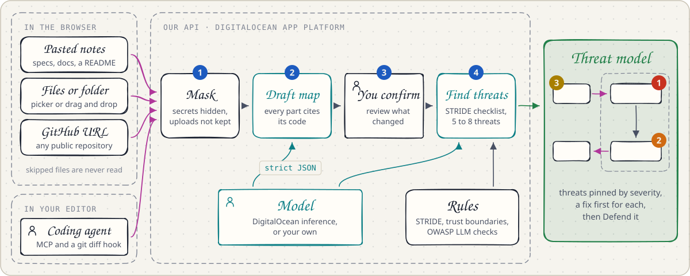

# ThreatViz Defend

Runtime threat modeling while you vibe code.

Coding agents let anyone ship an app they cannot explain. ThreatViz Defend reads your code and docs, or watches your coding agent as it works, draws the system as a threat model, and coaches you by text or voice until you can defend it at a whiteboard.

<!-- TODO: point Live app and Demo video at the real URLs before submitting -->
**[Live app](#)** · **[Demo video](#)** · **[Pitch deck](docs/pitch/threatviz-defend-pitch.pdf)** · **[Click to play demo](demo/index.html)** · Built at [hackUMBC 2026](#hackumbc-2026)

## The problem

Vibe coding is building software by telling a coding agent what you want and shipping what it writes. The code comes fast, but the understanding never forms. Nobody on the team holds a mental model of what shipped, so nobody can say which parts exist, where the data goes, or what trusts what.

Security depends on that model. Threat modeling, code review and incident response all assume someone understands the design. With vibe coding, often no one does, and the flaws stay hidden until an attacker finds them.

<picture>
  <source media="(prefers-color-scheme: dark)" srcset="docs/images/problem-dark.svg">
  
</picture>

## Our solution

ThreatViz Defend builds that mental model with you, from your own code, and then checks that it stuck. Reading a threat report is not the same as understanding it, so every board ends with a quiz on your own design.

It does not tell you a system is secure. It shows you where to look, and checks that you understood.

<picture>
  <source media="(prefers-color-scheme: dark)" srcset="docs/images/how-it-works-dark.svg">
  
</picture>


<sub>The Inbox Helper from the problem above, mapped by ThreatViz Defend. Each numbered pin is a threat.</sub>

| Know what to fix first | Prove you understand it |
|:---:|:---:|
|  |  |

### Runtime threat modeling

The map keeps up while your agent codes. Connect Claude Code or Cursor once, and every turn that changes the architecture updates the board.

1. **A turn ends.** Our hook runs when the agent stops.
2. **Snapshot.** It copies the working tree into a private git ref. Your branch, index, stash and files stay untouched.
3. **Diff.** It compares the snapshot with the last report, and files that hold secrets never enter the snapshot.
4. **Architectural or not.** It posts only changes to manifests, Dockerfiles, infrastructure, routes, env vars, databases, queues, model SDKs or auth. UI and refactor work is skipped.
5. **The map updates.** The board redraws, marks what changed, and waits for you to confirm it.

Over MCP the agent can also list your boards, read the map, ask the board what a change risks, report a change, and run the Defend questions right in the editor. [integrations/README.md](integrations/README.md) sets it up.

## Why it is a cybersecurity tool

Threat modeling means mapping how a system works, where its data flows and what trusts what, then asking what can go wrong at each step and fixing the worst of it before it ships. Security teams do it by hand. Vibe coding skips it entirely.

- **Threat modeling for every developer.** ThreatViz Defend runs the method on any codebase in minutes: STRIDE checks on every part, every flow that crosses a trust boundary, and the lethal trifecta on AI agents, which is private data, untrusted input and a way to send data out.
- **It trains the defender.** A report nobody understands fixes nothing. The Defend questions make sure the person who ships the code can explain how it can be attacked and what stops it.
- **It keeps up with AI-written code.** Agents change a system faster than anyone can review it, so every change redraws the map and waits for a person to confirm it.
- **It is defensive only.** It reads the material you give it. It never scans, probes or attacks a running system.

**Standards we build on:**

| Standard | How ThreatViz Defend uses it |
|---|---|
| [Threat Modeling Manifesto](https://www.threatmodelingmanifesto.org/) | Its four questions shape the flow: what are we working on, what can go wrong, what are we going to do about it, did we do a good enough job |
| STRIDE | The six threat categories, checked by rules on every part of the map |
| [OWASP](https://owasp.org/) | The Top 10 for LLM Applications 2025: prompt injection, data disclosure and excessive agency checks on every AI part |
| [CWE](https://cwe.mitre.org/) | Threats link to CWE and OWASP ids, and only when the model is sure of them |
| [NIST SSDF](https://csrc.nist.gov/projects/ssdf) | Practice PW.1.1 calls for threat modeling during design. ThreatViz Defend puts it in every developer's hands |

## Try it

**Watch it first.** Open [demo/index.html](demo/index.html) in a browser for a 30 second walkthrough: Claude Code builds an app, the hook posts each git diff, and the threat model draws and updates itself. It is a scripted animation with no setup. The [pitch deck](docs/pitch/threatviz-defend-pitch.pdf) tells the whole story in 13 slides.

**Hosted.** During hackUMBC, open the [live app](#) and create an account with the invite code from the organizers.

**On your machine.** You need Python 3.12 with [uv](https://docs.astral.sh/uv/) and Node 24.

```sh
./scripts/dev.sh
```

Open http://localhost:5173 and sign in with `DEV_USERNAME` and `DEV_PASSWORD` from `.env`. Without a model key, the app runs in demo mode on the Inbox Helper example.

<details>
<summary>Run each half on its own</summary>

```sh
cp .env.example .env          # once; the API reads the repo-root .env on its own
cd api && uv sync
uv run uvicorn app.main:app_from_env --factory --port 8000
```

```sh
cd web && npm install && npm run dev
```

The server creates the development account at startup, with the example board, and resets it to that password if you change it. To try sign up instead, choose **Create an account** with the invite code `local-dev`. Development uses a SQLite database in `api/data/app.db`.

</details>

<details>
<summary>Demo mode and real models</summary>

In demo mode every new account gets the example board ("Example: Inbox Helper") to explore, ask recorded questions about, and quiz yourself on. It cannot map your own material, and it grades open answers by keyword.

To use a real model, pick one:

- **Server default.** Set `LLM_BASE_URL`, `LLM_MODEL` and `LLM_API_KEY` in `.env`, then restart the API.
- **Your own provider.** Account menu > **Model provider**: save an OpenAI-compatible base URL, model and key, or a Backboard key. Under **Memory**, a Backboard key lets any of them remember your progress. This works in demo mode too, and only for your account.

</details>

<details>
<summary>Docker</summary>

`docker compose up --build` starts Postgres and one container that serves the API and the built web app at http://localhost:8080. It reads `.env` from the repo root. [docs/deploy.md](docs/deploy.md) covers production.

</details>

<details>
<summary>Admin commands</summary>

There is no admin page. On the server, from `api/`:

```sh
uv run python -m app.cli users              # list accounts
uv run python -m app.cli create-user <name> # add an account without an invite code; prompts for the password
uv run python -m app.cli disable <name>     # block an account and end its sessions
uv run python -m app.cli enable <name>
uv run python -m app.cli delete <name>      # delete an account and everything it owns
uv run python -m app.cli stats              # counts of accounts, boards and usage records
```

A deployed server refuses `DEV_USERNAME`, so operators create accounts this way.

</details>

<details>
<summary>Checks</summary>

```sh
cd api && uv run pytest && uv run ruff check . && uv run mypy
cd web && npm run typecheck && npm test && npm run build
```

After changing `api/app/schemas.py` or a route, run `npm run gen:api` in `web/` to regenerate the TypeScript types.

</details>

## How it is built

Anything you bring becomes a threat model. Every input is untrusted, so it passes through one API that owns every rule, every model call and all storage.

<picture>
  <source media="(prefers-color-scheme: dark)" srcset="docs/images/pipeline-dark.svg">
  
</picture>

<picture>
  <source media="(prefers-color-scheme: dark)" srcset="docs/images/architecture-dark.svg">
  
</picture>

- **Model.** Every model call goes through one interface and must return JSON that matches a schema. The default runs on DigitalOcean. Each user can switch to their own OpenAI-compatible endpoint or to Backboard.
- **Coding agents.** Claude Code and Cursor connect to `/mcp` with a personal token, or send diffs from a hook.
- **GitHub.** Importing a public repository downloads one archive from GitHub.
- **The browser only draws.** It shows what the API returns, so editing the page cannot change a threat or a grade.

[docs/architecture.md](docs/architecture.md) walks through every component, the board lifecycle and each model call.

### How DigitalOcean is used

DigitalOcean is the backbone the product runs on. One App Platform spec, [.do/app.yaml](.do/app.yaml), defines the whole app, and the default model runs on DigitalOcean too.

<picture>
  <source media="(prefers-color-scheme: dark)" srcset="docs/images/digitalocean-dark.svg">
  
</picture>

- **One spec, two components.** The API as a Docker service and the web app as a static site, in NYC, on our GoDaddy domain.
- **Deploy on push.** Every merge to main rebuilds both, behind a health check, with alerts when a deploy fails.
- **Gradient AI serverless inference.** The default model, `openai-gpt-oss-120b`, drafts maps, finds threats and grades answers.
- **Postgres 16 and encrypted secrets.** The database holds accounts, boards and progress. Keys live in encrypted App Platform secrets, and daily budgets cap what any one account can spend.

### How ElevenLabs is used

ElevenLabs is the voice layer. You can defend your threat model out loud, and ask the board a question by speaking it.

<picture>
  <source media="(prefers-color-scheme: dark)" srcset="docs/images/elevenlabs-dark.svg">
  
</picture>

- **The voice coach is an ElevenLabs Agent.** It asks the same questions as the text quiz, hears your answer, and replies out loud. [scripts/elevenlabs_agent.py](scripts/elevenlabs_agent.py) creates it with its prompt, model and tools.
- **It drives the board through four client tools.** It fetches the next question, submits your answer, lights parts of the map as it talks, and reads a spoken brief of the board. Our server grades every answer, never the agent.
- **The key stays on the server.** For each session the API mints a one-conversation token, and each user gets a daily voice budget.
- **Speech to Text for dictation.** The mic beside Ask records up to a minute, the API sends it to ElevenLabs Speech to Text (`scribe_v2`), and the text lands in the ask bar for you to check before sending.

### How Backboard is used

Backboard is a memory store. It remembers what each developer missed, so later answers and grades build on earlier sessions, across every board.

<picture>
  <source media="(prefers-color-scheme: dark)" srcset="docs/images/backboard-memory-dark.svg">
  
</picture>

Memory stays off until you add a Backboard key under **Model provider**, and it runs in one of two ways:

| Setup | What Backboard does | What stays out of memory |
|---|---|---|
| Backboard memory with any model | Before the API answers a question or grades an open answer, from the web app, the voice coach or a coding agent, it searches your assistant for up to five notes and fences them into the prompt. Afterwards it keeps a note of the question, and the verdict for a grade. When memory fails, the call goes on without it. | Your uploads, your maps, evidence quotes and the words of your answers |
| Backboard as your model | Runs every model call on a thread of your own Backboard assistant, with any model written as `provider/model`. Answers and grades read and write memory. | Your uploads. Mapping and threat finding, the calls that read them, only read memory |

Memory is kept this small on purpose: it lives on a third-party service and lasts across sessions, so it holds progress, never your code. Boards live in our Postgres, answer keys always come from code, and your Backboard key is sealed on the server.

## Security by design

<picture>
  <source media="(prefers-color-scheme: dark)" srcset="docs/images/output-checks-dark.svg">
  
</picture>

- Uploads are never stored, only their names and sizes.
- API keys never reach the browser or the logs.
- There is no admin page. Admin runs from the command line.
- Invite codes and daily budgets cap what any one account can spend.

[docs/security.md](docs/security.md) lists every control, our own threat model and the known limits.

## hackUMBC 2026

| Track | What we built for it | Status |
|---|---|---|
| Cybersecurity Application | A defensive tool that teaches developers the threat model of their own code. [Why it fits](#why-it-is-a-cybersecurity-tool) | Built |
| ElevenLabs | An ElevenLabs Agent as the voice coach, and Speech to Text for dictated questions. [How it is used](#how-elevenlabs-is-used) | Built |
| DigitalOcean | App Platform, Postgres 16, and Gradient AI serverless inference for the default model. [How it is used](#how-digitalocean-is-used) | Built |
| GoDaddy Registry | Our domain: `<domain goes here>` | To do |
| Backboard | A memory store of each developer's progress across boards and sessions. [How it is used](#how-backboard-is-used) | Built |
| Most Engaging Demo | Watch an agent build an app while its threat model draws, updates and gets defended by voice. [Click to play demo](demo/index.html) | Built |
| Best Overall | Runtime threat modeling end to end: from a prompt to a threat model you can defend | At the demo |

| Submission | Status |
|---|---|
| Public repo | Done |
| Demo video, 30 seconds or more | Recorded, link to add |
| Pitch deck | [Done](docs/pitch/threatviz-defend-pitch.pdf) |
| Live demo, 3 to 5 minutes | At the demo |
| Devpost entry by Sun 11:00 ET, final by 11:45 ET | In progress |

**Team:** Ricky (core engine), MD (diagrams), Eman (voice), Jonathan (hosting). [Who owns what](docs/team.md)

We wrote all of the code during the event. After judging we delete the deployment, its accounts and every key.

## Docs

| Doc | What it covers |
|---|---|
| [docs/user-guide.md](docs/user-guide.md) | Every screen and control, step by step, and troubleshooting |
| [docs/architecture.md](docs/architecture.md) | Components, the board lifecycle, model calls, rules, quiz, storage and the frontend |
| [docs/api.md](docs/api.md) | Every endpoint and MCP tool, errors, rate limits and budgets |
| [docs/security.md](docs/security.md) | What we protect, every control, our own threat model and known limits |
| [docs/deploy.md](docs/deploy.md) | Deploying to DigitalOcean App Platform |
| [integrations/README.md](integrations/README.md) | Connecting Claude Code and Cursor: MCP server and hook |
| [AGENTS.md](AGENTS.md) | Commands, contracts and rules for anyone changing the code |
| [demo/README.md](demo/README.md) | The click to play pitch demo: controls, recording and how to change the story |
| [docs/pitch/](docs/pitch/README.md) | The 13 slide pitch deck and its talk track |
| [docs/team.md](docs/team.md) | Who owns each area, how the areas attach to the core engine, and how to work in parallel |
| [docs/conventions.md](docs/conventions.md) | Code style, tests, docs, commits and pull requests |

<details>
<summary>Project layout</summary>

```
threat-viz-defend/
├── api/                          Python API server
│   ├── app/
│   │   ├── main.py               builds the app: routes, MCP server, web app, error shape
│   │   ├── config.py             settings from the environment, validated at startup
│   │   ├── schemas.py            the HTTP contract
│   │   ├── web.py                request guard: host, CSRF, JSON-only writes, headers
│   │   ├── limits.py             rate limiter and daily budgets
│   │   ├── mcp_tools.py          the remote MCP server for coding agents
│   │   ├── quiz_service.py       quiz state and grading
│   │   ├── voice.py              ElevenLabs conversation tokens and speech to text
│   │   ├── cli.py                admin commands
│   │   ├── routes/               one module per area of the API
│   │   ├── domain/               pure logic: models, rules, quiz, masking, report
│   │   ├── analysis/             prompts and the Analyst
│   │   ├── llm/                  model adapters: OpenAI-compatible, Backboard
│   │   ├── providers/            per-user providers, key encryption, URL guard
│   │   ├── boards/               board lifecycle, ingest, GitHub importer
│   │   ├── auth/                 accounts, sessions, personal tokens
│   │   └── examples/             the built-in example board
│   ├── tests/
│   └── pyproject.toml
├── web/                          React and TypeScript app
│   ├── src/
│   │   ├── api/                  typed client and generated schema types
│   │   ├── auth/                 home page, sign in and create account
│   │   ├── shell/                sidebar, routing, session, account menu
│   │   ├── board/                canvas, layout, inspector, intake, panels
│   │   ├── quiz/                 Defend tab and text quiz
│   │   ├── voice/                voice coach
│   │   ├── settings/             coding agents and model provider
│   │   └── styles/               design tokens
│   ├── openapi.json              the API schema the types come from
│   └── package.json
├── integrations/                 hook and config examples for coding agents
├── demo/                         the click to play pitch demo
├── docs/                         the docs listed above, and the pitch deck in docs/pitch/
├── .do/app.yaml                  App Platform spec
├── Dockerfile
├── docker-compose.yml
├── .env.example                  every server setting
└── AGENTS.md
```

</details>

## Tech stack

FastAPI, Pydantic, SQLAlchemy (SQLite or Postgres), argon2, the OpenAI Python SDK, the MCP Python SDK, React 19, Vite, ELK for layout, Rough.js for the hand-drawn look, zustand, and the ElevenLabs React SDK for voice.
