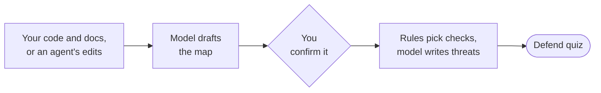
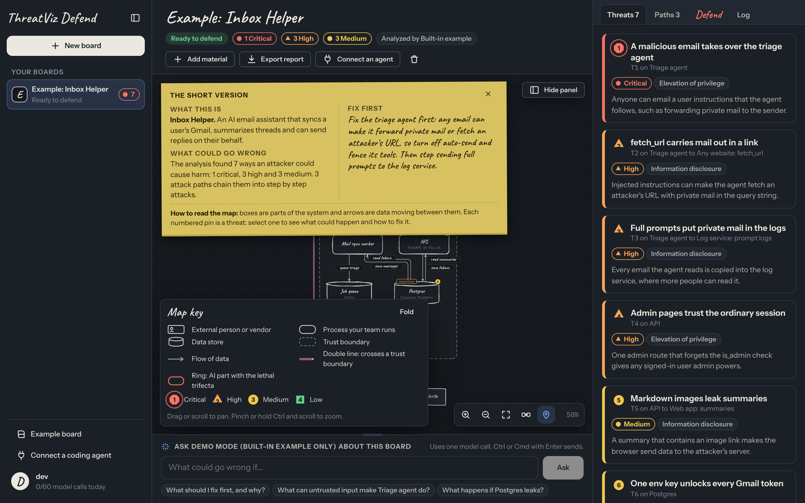
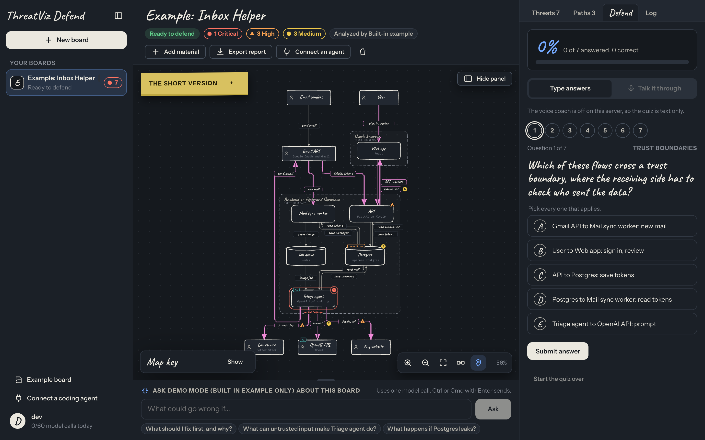
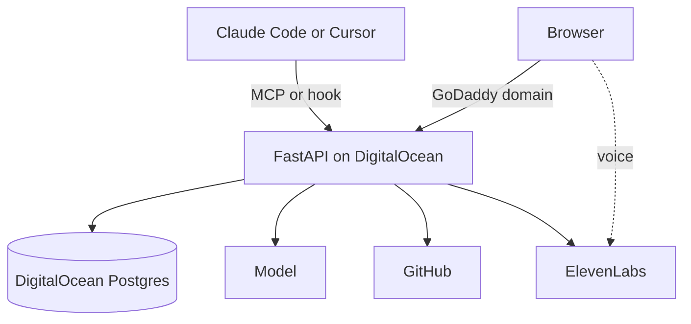
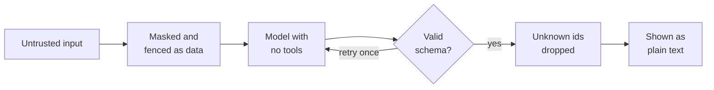

<div align="center">

# ThreatViz Defend

**See the code. Understand the threat.**

Your coding agent wrote it. ThreatViz Defend maps how it can be attacked, then quizzes you until you can defend it at a whiteboard.

[](https://hackumbc-2026.devpost.com/)


<!-- TODO: point Live app and Demo video at the real URLs before submitting -->
**[Live app](#)** · **[Demo video](#)** · **[Devpost](https://hackumbc-2026.devpost.com/)**

</div>


## How it works



| Know what to fix first | Prove you understand it |
|:---:|:---:|
|  |  |

## hackUMBC 2026

| Track | What we built for it | |
|---|---|:---:|
| 🛡️ Cybersecurity Application | Evidence-cited threat models and a quiz that proves you understood them. [Our own threat model](docs/security.md) | ✅ |
| 🎙️ ElevenLabs | A voice coach that runs the quiz out loud, and dictation for questions | ✅ |
| 🌊 DigitalOcean | App Platform, Managed Postgres, and serverless inference for the default model | ✅ |
| 🌐 GoDaddy Registry | Our domain: `<domain goes here>` | ⏳ |
| 🧠 Backboard | Analysis through Backboard, with memory across sessions | ✅ |
| 🎤 Most Engaging Demo | A judge talks with the voice coach about how this app can be attacked | 🎬 |
| 🏆 Best Overall | The whole path, end to end | 🎬 |

<sub>✅ done · ⏳ before submission · 🎬 at the live demo</sub>

| Submission | |
|---|:---:|
| Public repo | ✅ |
| Demo video, 30 seconds or more | ⏳ |
| Live demo, 3 to 5 minutes | 🎬 |
| Devpost entry by Sun 11:00 ET, final by 11:45 ET | ⏳ |

**Team:** Ricky (core engine), MD (diagrams), Eman (voice), Jonathan (hosting). [Who owns what](docs/team.md)

All code was written during the event. Sign up needs an invite code handed out in person, and we delete the deployment, its accounts and every key after judging.

## Architecture



## Security by design

Every model reply is untrusted until code checks it.



- Uploads are never stored, only their names and sizes.
- API keys never reach the browser or the logs.
- Quiz answer keys come from code, never a model.
- No admin page: admin runs from the command line.

[docs/security.md](docs/security.md) has every control and our known limits.

## Quick start

Needs Python 3.12 with [uv](https://docs.astral.sh/uv/) and Node 24.

```sh
./scripts/dev.sh
```

Open http://localhost:5173 and sign in with `DEV_USERNAME` and `DEV_PASSWORD` from `.env`. With no model key set, the app runs in demo mode on a finished example board.

<details>
<summary>Run each half on its own</summary>

```sh
cp .env.example .env          # once; the API reads the repo-root .env on its own
cd api && uv sync
uv run uvicorn app.main:app_from_env --factory --port 8000
```

```sh
cd web && npm install && npm run dev
```

The server creates the development account at startup, with the example board, and resets it to that password if you change it. To try sign up instead, choose **Create an account** with the invite code `local-dev`. Development uses a SQLite database in `api/data/app.db`.

</details>

<details>
<summary>Demo mode and real models</summary>

In demo mode every new account gets the example board ("Example: Inbox Helper") to explore, ask recorded questions about, and quiz yourself on. It cannot map your own material, and it grades open answers by keyword.

To use a real model, pick one:

- **Server default.** Set `LLM_BASE_URL`, `LLM_MODEL` and `LLM_API_KEY` in `.env`, then restart the API.
- **Your own provider.** Account menu > **Model provider**: save an OpenAI-compatible base URL, model and key, or a Backboard key. Under **Memory**, a Backboard key lets any of them remember your progress. This works in demo mode too, and only for your account.

</details>

<details>
<summary>Docker</summary>

`docker compose up --build` starts Postgres and one container that serves the API and the built web app at http://localhost:8080. It reads `.env` from the repo root. [docs/deploy.md](docs/deploy.md) covers production.

</details>

<details>
<summary>Admin commands</summary>

There is no admin page. On the server, from `api/`:

```sh
uv run python -m app.cli users              # list accounts
uv run python -m app.cli create-user <name> # add an account without an invite code; prompts for the password
uv run python -m app.cli disable <name>     # block an account and end its sessions
uv run python -m app.cli enable <name>
uv run python -m app.cli delete <name>      # delete an account and everything it owns
uv run python -m app.cli stats              # counts of accounts, boards and usage records
```

A deployed server refuses `DEV_USERNAME`, so operators create accounts this way.

</details>

<details>
<summary>Checks</summary>

```sh
cd api && uv run pytest && uv run ruff check . && uv run mypy
cd web && npm run typecheck && npm test && npm run build
```

After changing `api/app/schemas.py` or a route, run `npm run gen:api` in `web/` to regenerate the TypeScript types.

</details>

## Docs

| Doc | What it covers |
|---|---|
| [docs/user-guide.md](docs/user-guide.md) | Every screen and control, step by step, and troubleshooting |
| [docs/architecture.md](docs/architecture.md) | Components, the board lifecycle, model calls, rules, quiz, storage and the frontend |
| [docs/api.md](docs/api.md) | Every endpoint and MCP tool, errors, rate limits and budgets |
| [docs/security.md](docs/security.md) | What we protect, every control, our own threat model and known limits |
| [docs/deploy.md](docs/deploy.md) | Deploying to DigitalOcean App Platform |
| [integrations/README.md](integrations/README.md) | Connecting Claude Code and Cursor: MCP server and hook |
| [AGENTS.md](AGENTS.md) | Commands, contracts and rules for anyone changing the code |
| [docs/team.md](docs/team.md) | Who owns each area, how the areas attach to the core engine, and how to work in parallel |
| [docs/conventions.md](docs/conventions.md) | Code style, tests, docs, commits and pull requests |

<details>
<summary>Project layout</summary>

```
threat-viz-defend/
├── api/                          Python API server
│   ├── app/
│   │   ├── main.py               builds the app: routes, MCP server, web app, error shape
│   │   ├── config.py             settings from the environment, validated at startup
│   │   ├── schemas.py            the HTTP contract
│   │   ├── web.py                request guard: host, CSRF, JSON-only writes, headers
│   │   ├── limits.py             rate limiter and daily budgets
│   │   ├── mcp_tools.py          the remote MCP server for coding agents
│   │   ├── quiz_service.py       quiz state and grading
│   │   ├── voice.py              ElevenLabs conversation tokens and speech to text
│   │   ├── cli.py                admin commands
│   │   ├── routes/               one module per area of the API
│   │   ├── domain/               pure logic: models, rules, quiz, masking, report
│   │   ├── analysis/             prompts and the Analyst
│   │   ├── llm/                  model adapters: OpenAI-compatible, Backboard
│   │   ├── providers/            per-user providers, key encryption, URL guard
│   │   ├── boards/               board lifecycle, ingest, GitHub importer
│   │   ├── auth/                 accounts, sessions, personal tokens
│   │   └── examples/             the built-in example board
│   ├── tests/
│   └── pyproject.toml
├── web/                          React and TypeScript app
│   ├── src/
│   │   ├── api/                  typed client and generated schema types
│   │   ├── auth/                 home page, sign in and create account
│   │   ├── shell/                sidebar, routing, session, account menu
│   │   ├── board/                canvas, layout, inspector, intake, panels
│   │   ├── quiz/                 Defend tab and text quiz
│   │   ├── voice/                voice coach
│   │   ├── settings/             coding agents and model provider
│   │   └── styles/               design tokens
│   ├── openapi.json              the API schema the types come from
│   └── package.json
├── integrations/                 hook and config examples for coding agents
├── docs/                         the docs listed above
├── .do/app.yaml                  App Platform spec
├── Dockerfile
├── docker-compose.yml
├── .env.example                  every server setting
└── AGENTS.md
```

</details>

## Tech stack

FastAPI, Pydantic, SQLAlchemy (SQLite or Postgres), argon2, the OpenAI Python SDK, the MCP Python SDK, React 19, Vite, ELK for layout, Rough.js for the hand-drawn look, zustand, and the ElevenLabs React SDK for voice.
