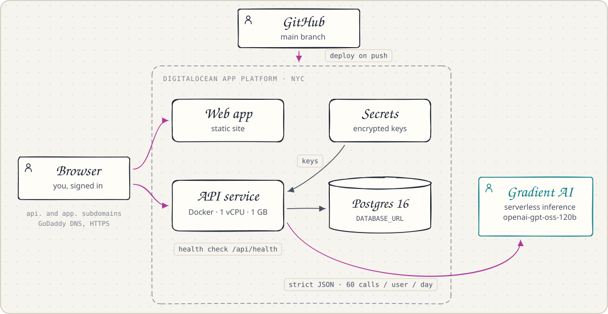
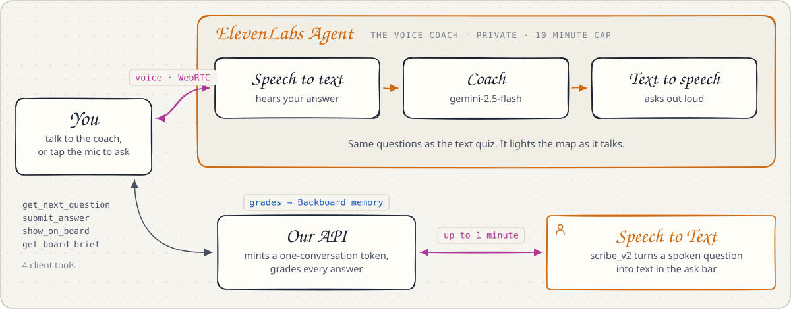
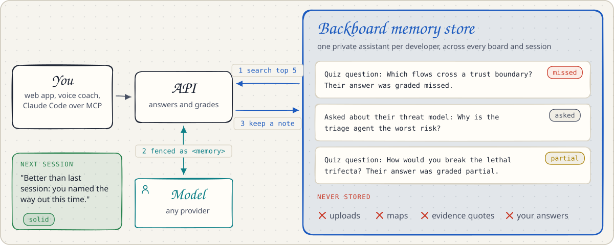
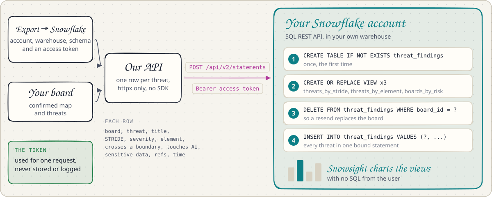

# Services

ThreatViz Defend needs one outside service to map your own code: a model that speaks the OpenAI Chat Completions API. Without one it runs in demo mode on the built-in example. Everything else on this page is optional, and the app works with each piece turned off.

<picture>
  <source media="(prefers-color-scheme: dark)" srcset="images/architecture-dark.svg">
  
</picture>

| Service | What it adds | Turn it on |
|---|---|---|
| A model: DigitalOcean serverless inference by default, or any OpenAI-compatible endpoint | Drafts maps, finds threats, answers questions and grades open answers | `LLM_BASE_URL`, `LLM_MODEL` and `LLM_API_KEY` in `.env`, or per account under Settings, **Model provider** |
| DigitalOcean App Platform | Hosting from one spec, with Postgres and encrypted secrets | [.do/app.yaml](../.do/app.yaml) and [deploy.md](deploy.md) |
| ElevenLabs | The voice coach and dictation | `ELEVENLABS_API_KEY`, plus `ELEVENLABS_AGENT_ID` for the coach |
| Backboard | Memory of what each developer asked and missed | `BACKBOARD_API_KEY`, or per account under Settings, **Memory** |
| Snowflake | Your board's threats as rows in your own account | Nothing on the server: each export brings its own token |

[security.md](security.md#data-sent-to-third-parties) lists exactly what each service receives. The rest of this page says how each one is used.

## DigitalOcean

DigitalOcean can run the whole app. One App Platform spec, [.do/app.yaml](../.do/app.yaml), defines it, and the default model runs on DigitalOcean too.

<picture>
  <source media="(prefers-color-scheme: dark)" srcset="images/digitalocean-dark.svg">
  
</picture>

- **One spec, two components.** The API as a Docker service and the web app as a static site, in the New York region, served at a custom domain.
- **Deploy on push.** Every merge to main rebuilds both, behind a health check, with alerts when a deploy fails.
- **Gradient AI serverless inference.** The default model, `openai-gpt-oss-120b`, drafts maps, finds threats and grades answers.
- **Postgres 16 and encrypted secrets.** The database holds accounts, boards and progress. Keys live in encrypted App Platform secrets, and daily budgets cap what any one account can spend.

[deploy.md](deploy.md) walks through a deploy step by step.

## ElevenLabs

ElevenLabs is the voice layer. You can defend your threat model out loud, and ask the board a question by speaking it.

<picture>
  <source media="(prefers-color-scheme: dark)" srcset="images/elevenlabs-dark.svg">
  
</picture>

- **The voice coach is an ElevenLabs Agent.** It asks the same questions as the text quiz, hears your answer, and replies out loud. [scripts/elevenlabs_agent.py](../scripts/elevenlabs_agent.py) creates it with its prompt, model and tools.
- **It drives the board through four client tools.** It fetches the next question, submits your answer, lights parts of the map as it talks, and reads a spoken brief of the board. Our server grades every answer, never the agent.
- **The key stays on the server.** For each session the API mints a one-conversation token, and each user gets a daily voice budget.
- **Speech to Text for dictation.** The mic beside Ask records up to a minute, the API sends it to ElevenLabs Speech to Text (`scribe_v2`), and the text lands in the ask bar for you to check before sending.

[web/src/voice/AGENTS.md](../web/src/voice/AGENTS.md) says how to create the agent and turn both on.

## Backboard

Backboard is the memory layer around the model. The model makes every call; Backboard remembers what each developer asked and missed, across every board and session, and feeds it into the calls that teach them. Each developer gets their own Backboard assistant.

<picture>
  <source media="(prefers-color-scheme: dark)" srcset="images/backboard-memory-dark.svg">
  
</picture>

With `BACKBOARD_API_KEY` set on the server, memory is on for every account; each developer can turn it off, or use their own Backboard key, under **Memory**.

| When | What Backboard does | What you see |
|---|---|---|
| Before an answer or a grade | The API searches the developer's notes for ones related to the question and fences up to five into the model's prompt as untrusted context | Under the answer or grade: "Backboard fed 2 earlier notes into this answer", with the notes |
| After a question or any quiz answer | The API keeps a note in the background: the board's title, the question, and for the quiz the topic and how it went | "Saved to memory" |
| When a quiz opens | The API reads the notes back into the topics the developer got wrong or partly right, and asks those questions first, on the web, over MCP and with the voice coach | "From Backboard memory: you found these hard in earlier sessions, so they come first" |
| Any time | Settings, **Memory** lists every note Backboard holds, turns memory off, forgets everything, or takes the developer's own Backboard key | The **Memory** page, and "Backboard memory: on" in the sidebar |

Memory is kept this small on purpose: it lives on a third-party service and lasts across sessions, so it holds progress, never your code. Notes never hold uploads, maps or the words of an answer. When Backboard fails, the answer or grade goes on without memory. Boards live in the app's own database, answer keys always come from code, and a developer's own Backboard key is sealed on the server.

## Snowflake

One click sends a board's threats to your own Snowflake account, so you can chart risk across every board you have analyzed. Choose **Export**, then **Snowflake**, and enter your account, warehouse, database, schema and a programmatic access token.

<picture>
  <source media="(prefers-color-scheme: dark)" srcset="images/snowflake-dark.svg">
  
</picture>

- **The SQL REST API, no SDK.** The API posts each statement to `/api/v2/statements` with your token, using the HTTP client it already has.
- **Chart-ready views.** Every export refreshes `threats_by_stride`, `threats_by_element` and `boards_by_risk`, so a Snowsight dashboard needs no SQL.
- **Safe to resend.** An export replaces that board's rows instead of duplicating them.
- **Your account, your token.** The token is used for that one request and never stored or logged. Only the threat rows leave the server, never your uploads or the map's evidence.
